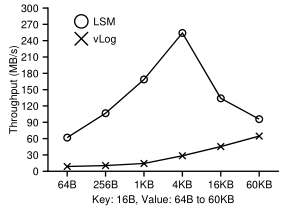
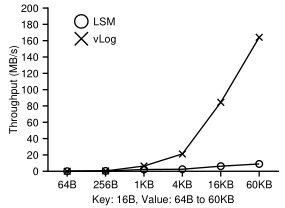
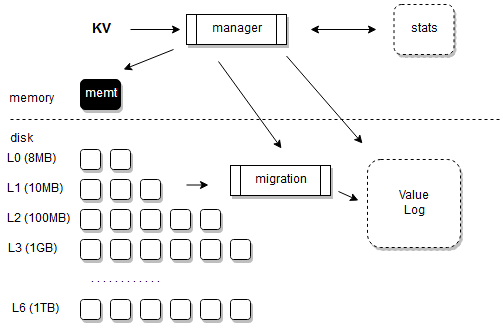
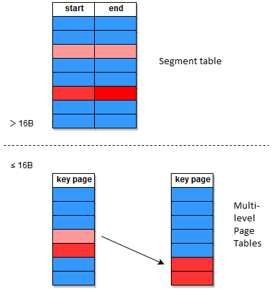
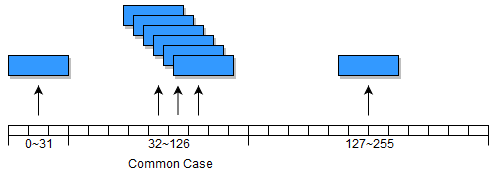

# Managed Storage Hierarchy in WiscKey
## Introduction
[WiscKey](https://www.usenix.org/system/files/conference/fast16/fast16-papers-lu.pdf) exploits the high parallel random-read performance of SSD by seperating value from key. While WiscKey has an overall better performance than LevelDB, it has a poor range query performance when value size is small. Therefore, we design a managed storage hierarchy to combine the performance advantages of LevelDB with Wisckey by storing frequently range queried data into LSM tree directly. The range query and random lookup performance of data from LSM tree and vLog in WiscKey are shown below.

|||
| ----|----|
| <sub>**Range Query Performance.** This figure shows range query performance. 256 MB of data is range queried from a 1-GB database with values loaded to LSM or vLog.</sub>|<sub>**Random Lookup Performance.** This figure shows the random lookup performance from a 1-GB database with values loaded to LSM or vLog.</sub>|

Managed storage hierarchy includes three parts: Migration Process, Statistics and Manager. 

During the data load, Manager decides where the values should be inserted. For value with size smaller than 4 bytes, it is directly inserted into LSM tree because it is smaller than the pointer. For value with size larger than 64 KB, it is directly inserted into vLog because vLog provides a better range query performance when value size is larger than 64KB . If value size is between 4 bytes and 64 KB, the choice is based on the statistics of current storage and range query pattern to achieve the following goals:

- The size of LSM tree should not be too large. As shown above, random loopkup performance is affected largely when data are all loaded to LSM tree. We need to maintain a balance between data in LSM tree and data in vLog so that random lookup performance is not affected too much. For example, at most 30% values are loaded directly into LSM tree. Otherwise, the manager should call migration process to migrate values from the LSM tree to vLog.

- Values that are more likely to be range queried should stay at LSM tree. Because the proportion of data in LSM tree should not be too large, we only store the hottest data. In one sense, LSM tree is like a cache storing only frequently or recently range queried data. 

- Data in LSM tree should be migrated back to vLog gradually as users do a large number of random lookups. There is no need to keep data in LSM tree if users only use random lookup. 



In order to better predict the range query pattern, we utilize temporal and spatial locality: the key ranges that are range queried before are more likely to the range queried in the future. This principle is from the design of cache. However, while cache deals with units of data, we need to consider ranges of data. We would always receive statistics in form of [start key of range query, end key of range query] after user uses iterator. Besides, the overlap between two ranges of keys should not be neglected. For example, if user frequently range query [1,3] and [2,4], then values with keys between [2,3] are more likely to be stored in LSM tree than [1,2] and [3,4]. The problem is more similar to the memory management, in which we need to deal with the statistics of a huge range. 

Statistics is implemented using Segment Table in \badger\stat\segment.go, Migration is implemented in \badger\db.go and Manager is implemented in \badger\manager.go. They are all designed to be thread safe.

## Challenges

There are two Main challenges:


<details><summary markdown='span'>Migration Process is responsible for moving data in the background. It should always give high priority to user's transaction to not affect the foreground performance and avoid value overwriting. However, it is very hard to decide when is the best time to migrate data.
</summary> 
<br />
Current solution is to set a timeout. If there is a transcation during the migration process, migration process will sleep and retry after the timeout. The timeout will grow if transcations keep happening during the migration process (which means that foreground is really busy). However, migration process may wait unnecessarily long as timeout grows. We could decide when to migrate data by tracing block I/O in the future work.
</details>
<br />

<details><summary markdown='span'>Key is byte array in nature. Key range is unbounded, which makes the statistics hard to design. Therefore, our problem is similiar to managing an unbounded memory!</summary> 
<br />

We propose Segment Table to manage the unbouned range. Segment is able to manage unbounded range because it just store the start point and end point of a range. Its table size doesn't grow as the range size grows. However, Segment treats a large range as a whole and its management may be coarse-grained.

We define the heat of a certain range of keys as the possibility that these keys will be range queried in the future. To decide whether to move data between LSM tree and vLog, we use two threshold values: freezing point and boiling point. If the segment heat is above boiling point, its data will be passed to the move process and will be moved from vLog to LSM. If the segment heat is below freezing point, its data will be passed to the move process and will be moved from LSM to vLog. The use of both boiling point and freezing point instead of one threshold value is to avoid thrashing: if a segment’s heat is changing frequently between one interval, we shouldn’t move it.

Our Segment Table tries to imitate a fine-grained Table (e.g., Page Table) by the following optimizations:

- Short Segment Coalesce: for short segments included in a long segment, they will be coalesced into the long segment

- Long Segment Division: for long segment, if only part of it is queried frequently, it will be divided into small segments

Our Segment Table is still under development. You can find the ideas behind current design in the following reports:

- [First Design](seg/Segment.pdf)

- [Short Segment](seg/wisckeyseg.pdf)

- [Long Segment](seg/LSO.pdf)

</details>
<br />

## Future works

<details><summary markdown='span'>Upper bound size of Segment table</summary> 
<br />
We don’t want to let the segment table occupy to much memory. We can set the upper bound size of Segment Table to be about 1MB. 

1MB is large enough for small keys. For example, if keys are 16B in size, 1MB segment table could hold 1024*1024/((56+16+16))=11915 segments! (56 is because 4(heat int32) + 1 (inLSM bool) + 1 (valid bool) + 2 (padding) + 24(start slice) + 24(end slice), slice is 24 because 8(pointer) + 8(int) + 8(end) on my 64 bit machine; for a 32 bit machine slice size should be 12)

The Segment Table will be full when inserting new segment will make the table size exceed 1 MB. In this situation, we need a Replacement Policy. A reasonable replacement policy should be Coldest First Replacement Policy, which is similar to Least Frequently Used Replacement Policy. However, there’s some problems if we use Coldest First Replacement Policy. It is possible that the coldest segment is small in size, but the new segment is large in size. Therefore, even if we replace the coldest segment with the new segment, table size may still exceed 1MB.

One possible way is to find the coldest segment, the second coldest segment, the third coldest segment, … so that replacing these segments with a new one will make the segment table smaller than 1MB. One problem of this solution is that a new large segment will replace too many small segments, so that the statistics of small keys will be lost. 

The other way is to only find the coldest segment whose size is larger than the new segment so that replacing this segment will only make the segment table smaller. One problem of this solution is that new large segment may never be inserted into the segment table if there aren’t any larger segments. 

The first approach favors large segments while the second approach favors small segments. Since WiscKey is used mainly for small key, we choose the second replace policy here. Another optimization is that we only replace segments below freezing point. For segments above freezing points, they must be in the segment table because they are likely to have already been in the LSM tree and we need to manage them through Segment Table.

Therefore, the final algorithm for replacement should be:

```
Insert (NewSeg)
if (size(NewSeg) + size(SegTable)) > 1MB
	For seg in SegTable
		if size(seg) > size(NewSeg) and seg.T < freezing point and seg.T < coldestT	
			Coldestseg = seg		
			coldest = seg.T		
	if Coldestseg not null
		replace Coldestseg with NewSeg
```
</details>
<br />

<details><summary markdown='span'>Embeded Multi-level Page Tables</summary> 
<br />
 
Because WiscKey is used commonly for small key, we can embed a data structure similar to Multi-level Page Tables in the Segment Table to store fine-grained statistics. Pairs with key smaller than or equal to 16B should be stored in Multi-level Page Tables and pairs with key larger than 16B should be stored in Segment Table.

For Multi-level Page Tables, the whole range is coarsely divided into certain number of ranges at the first level. After range queries, the corresponding range will be heated. A second level table will be created to store more fine-grained statistics in the following situations:

- only a small portion of the range at the first level is queried.

- the heat of the range in the first level is large enough so that the manager will consider inserting values with keys in that range to the LSM tree directly.

There is also a cooling process by the Manager to move data back to vLog. The cooling process is triggerd if there are a large number of random lookups, or the size of LSM tree is too large. The cooling will be distributed evenly to all the warm ranges. If a range is cold enough, all its value in the LSM tree will be moved to vLog and the memory for its multi-level page tables will be deallocated.



</details>
<br />

<details><summary markdown='span'>Key Page Division</summary> 
<br />
	
This optimization is for Multi-level Page Tables.
	
WiscKey stores key and value using byte array, and compares key using Bytes.Compare(). Bytes.Compare() compares two byte slices lexicographically: it compares the first byte, if equal then the second byte … This will cause a problem: “2” is larger than “11” just because the first byte ‘2’ is larger than ‘1’. A single solution is to compare the length of byte array first, then use Bytes.Compare(). Maybe we can also collect some statistics about how user loads data and choose the comparison method smartly.
	
Another problem is how to divide byte array into pages. We could divide the byte range equally because page should be fixed in size. Notice that byte array is often used to store string, we could divide more pages for byte from 32 to 126 because their ASCII representations are more common. This optimization is thus intended to make common cases fast. Users may also want to record the key numerically using byte. If byte from 0 to 32 or 126 to 255 is hot, their next level table will divide the byte range evenly.


</details>
<br />

## Project Status
This project is based on https://github.com/dgraph-io/badger.
After installing the badger, replace the /draph-io directory in $GOPATH with /draph-io in our project.
To load key-value pair directly into LSM-tree like LevelDB, you can use the txn.LevelDBSet() method:

```go
err := txn.LevelDBSet([]byte("key"), []byte("value"))
if err != nil {
	return err
}
```

A more smart Set method is under development! You can use txn.HybridSet() method:

```go
err := txn.HybridSet([]byte("key"), []byte("value"))
if err != nil {
	return err
}
```
This HybridSet will store the data according to your usage patterns in Statistics.

Currently, we are trying to find the best tuning. 

The graphs of the results are made using zplot http://pages.cs.wisc.edu/~remzi/Zplot/z-plot/docs/index.html.
